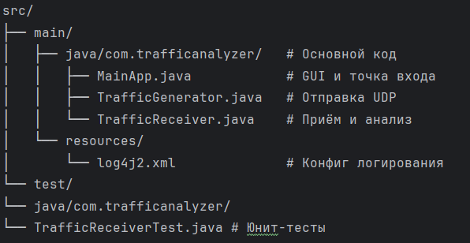

# TrafficGenAnalyzers

**Курсовой проект по дисциплине Разработка защищенных сетевых приложений**  
**Автор**: Артюков Д.А, студент группы ИКБ-43  
**Технологии**: Java 21, Gradle, JavaFX, log4j2, JUnit 5  


---

##  Описание

Программа **TrafficGenAnalyzers** предназначена для **тестирования сетевой нагрузки** между двумя узлами (генератором и приёмником). Она измеряет ключевые сетевые метрики:

- 📏 **Средняя задержка** (latency)
- 📊 **Скорость передачи** (throughput, бит/с)
- 📉 **Потери пакетов** (%)
---

## ⚙️ Функционал

| Компонент | Возможности |
|----------|-------------|
| **Генератор трафика** | Отправка UDP-пакетов с настройкой:<br>• Кол-во пакетов<br>• Размер пакета (байты)<br>• Частота (пакетов/сек) |
| **Приёмник трафика** | Приём пакетов + расчёт:<br>• Задержки (разница времени отправки/приёма)<br>• Потерь (по пропущенным номерам)<br>• Скорости (бит/с) |
| **Графический интерфейс** | JavaFX-окно с полями ввода и кнопками управления |
| **Логирование** | Вывод в консоль и файл `traffic.log` (log4j2) |
| **Тестирование** | Unit-тесты на JUnit 5 |
| **Документация** | JavaDoc в HTML-формате |

---

## 📦 Структура проекта

---

## 🧪 Требования

- **JDK**: Java 21 (рекомендуется [Microsoft Build of OpenJDK 21](https://learn.microsoft.com/en-us/java/openjdk/))
- **Сборка**: Gradle 8+


---

## ▶️ Запуск проекта

### В IntelliJ IDEA
1. Открой проект как **Gradle Project**
2. Запусти через:  
   **Gradle → Tasks → application → run**

### Сборка JAR-файла
```bash
./gradlew build
